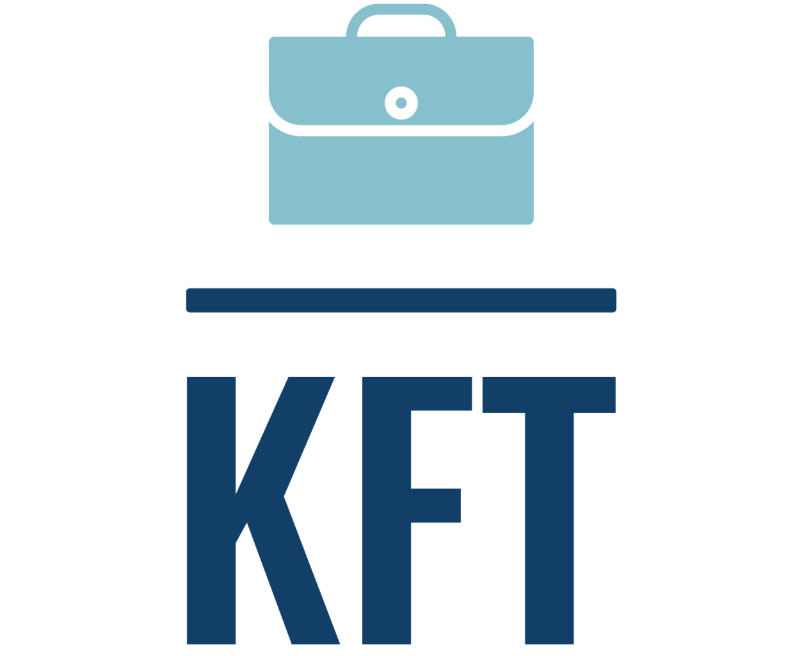

# About KFT

KFT is a company that specializes in machine learning and artificial intelligence based projects. We provide complete software solutions that nourishes the performance of an organization with our revloutionary system solutions.

Based in Malacca,Malaysia

## Our Mission

Revolutionizing future organization system based on Artificial Intelligence

## Innovation

Enhancing and nurturing human being capabilities with AI

## Our Team

CHIEF EXECUTIVE OFFICER (CEO)

KAVINRAJ A/L SIVAKUMAR

Responsibility:
1. Making crucial business decisions
2. Managing and allocating workforce
3. Ensuring project completed by dateline
4. Managing distribution of company resources

CHIEF OPERATING OFFICER (COO)

MUHAMMAD FARHAN BIN MOHD NOOR

Responsibility:
1. Provide project outline to CEO directly
2. Assist CEO in maintaining good public affairs
3. Acknowledge stable relations with company members
4. Acknowledging potential risk to the company

CHIEF TECHNOLOGY OFFICER (CTO)

TONG YING FAN

Responsibility:
1. Making the technical decision regarding algorithms to be used
2. Passing information to corporate hierarchy about project deliverables
3. Allocating task for the technical team members of the project
4. Making a safe and secure development and production environment through necessary strategies

